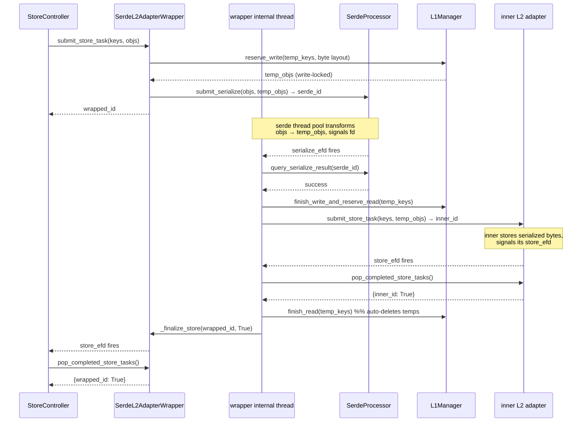
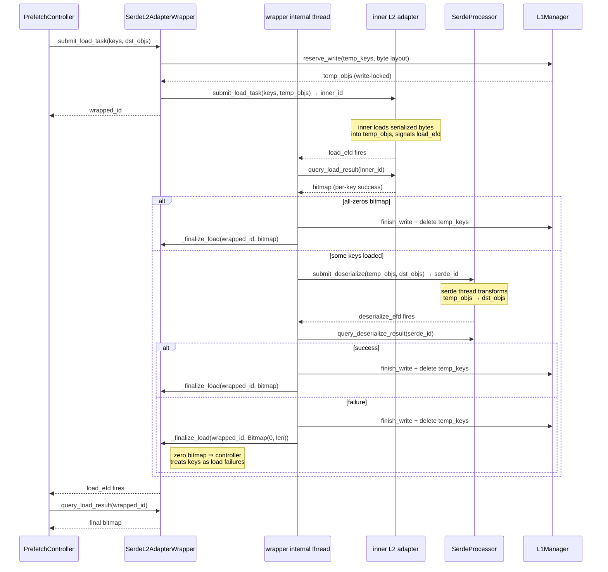

# `SerdeL2AdapterWrapper` — Transparent Serde via Adapter Composition

## Scope

Describes how serialization / deserialization is integrated into the
L2 path. The serde package itself
([`docs/design/v1/distributed/serde/README.md`](../serde/README.md))
defines the generic `Serializer` / `Deserializer` / `SerdeProcessor`
interfaces and the fp8 built-in. **This** doc is about the adapter
that stitches serde into the distributed storage pipeline.

## Design Summary

`SerdeL2AdapterWrapper` implements `L2AdapterInterface` by composing
an inner L2 adapter with a `SerdeProcessor` and an `L1Manager`. The
caller sees the wrapper's public API only; the wrapper's internal
thread is the sole consumer of the inner adapter's and serde's event
fds.

Step numbers below show **call ordering**. Solid `─►` arrows are
direct synchronous calls; dotted `╌►` arrows are eventfd wakeups
consumed by the wrapper's internal thread.

### Store path

```
   caller                                                          
     │                                                             
     │ (1) submit_store_task(keys, objs)                           
     ▼                                                             
   ┌─────────────────┐  (2) reserve_write(tmp)   ┌──────────────┐  
   │  wrapper (API)  │ ─────────────────────────►│  L1Manager   │  
   │                 │ ◄────── tmp_objs ─────────│              │  
   └────────┬────────┘                           └──────────────┘  
            │ (3) submit_serialize(objs, tmp_objs)                 
            ▼                                                      
   ┌─────────────────┐                                             
   │ SerdeProcessor  │   transforms objs → tmp_objs                
   └────────┬────────┘                                             
            ╎ (4) serialize_efd                                    
            ▼                                                      
   ┌─────────────────┐  (5) inner.submit_store_   ┌──────────────┐ 
   │ wrapper thread  │      task(keys, tmp_objs)  │   inner L2   │ 
   │   (_loop)       │ ─────────────────────────► │   adapter    │ 
   └────────┬────────┘                            └──────┬───────┘ 
            ▲                                            │         
            ╎ (6) inner.store_efd ◄──────────────────────┘         
            │                                                      
   ┌────────┴────────┐                                             
   │ wrapper thread  │  (7) finish_read(tmp_objs)  → auto-delete   
   │                 │      signal wrapper.store_efd               
   └────────┬────────┘                                             
            │                                                      
            │ (8) pop_completed_store_tasks() → {wrapped_id: True} 
            ▼                                                      
          caller                                                   
```

### Load path

```
   caller                                                          
     │                                                             
     │ (1) submit_load_task(keys, dst_objs)                        
     ▼                                                             
   ┌─────────────────┐  (2) reserve_write(tmp)   ┌──────────────┐  
   │  wrapper (API)  │ ─────────────────────────►│  L1Manager   │  
   │                 │ ◄────── tmp_objs ─────────│              │  
   └────────┬────────┘                           └──────────────┘  
            │ (3) inner.submit_load_task(keys, tmp_objs)           
            ▼                                                      
   ┌─────────────────┐                                             
   │  inner L2       │   loads serialized bytes into tmp_objs      
   │  adapter        │                                             
   └────────┬────────┘                                             
            ╎ (4) inner.load_efd                                   
            ▼                                                      
   ┌─────────────────┐  (5) submit_deserialize    ┌──────────────┐ 
   │ wrapper thread  │      (tmp_objs, dst_objs)  │   Serde      │ 
   │   (_loop)       │ ─────────────────────────► │  Processor   │ 
   └────────┬────────┘                            └──────┬───────┘ 
            ▲                                            │         
            ╎ (6) deserialize_efd ◄──────────────────────┘         
            │                                                      
   ┌────────┴────────┐                                             
   │ wrapper thread  │  (7) finish_write + delete(tmp_objs)        
   │                 │      signal wrapper.load_efd                
   └────────┬────────┘                                             
            │                                                      
            │ (8) query_load_result() → per-key bitmap             
            ▼                                                      
          caller                                                   
```

## Store Path



## Load Path



## Lookup / Unlock / Eviction

These paths don't involve any transform, so the wrapper delegates
directly to the inner adapter — including the lookup event fd
itself, to avoid an unnecessary thread hop per lookup.

| API | Behavior |
|---|---|
| `get_lookup_and_lock_event_fd` | Returns the inner adapter's fd (pass-through) |
| `submit_lookup_and_lock_task` / `query_lookup_and_lock_result` | Delegated directly |
| `submit_unlock` | Delegated directly |
| `delete` / `get_usage` / `supports_global_eviction` | Delegated directly |
| `register_listener` | Registers on the inner adapter (listeners track real storage state) |

The wrapper does **not** maintain its own byte accounting — it
reports whatever the inner adapter reports. This keeps
`L2EvictionController` and per-cache_salt quota logic unchanged:
they see the inner adapter's byte totals through the wrapper's
`get_usage()`.

## Temp Buffer Lifecycle

Temp byte buffers are the only new L1 state the wrapper introduces.
They exist entirely within the wrapper's knowledge — the caller never
sees the temp keys.

**Store path:**

1. `reserve_write(temp_keys, is_temporary=True, layout=ser_layout, mode="new")`
   — temps are write-locked and marked temporary so
   `finish_read` will auto-delete them later.
2. Serialize runs, filling temps.
3. On success: `finish_write_and_reserve_read(temp_keys)` — temps
   become read-locked so `inner.submit_store_task` can safely read
   them.
4. Inner store completes → `finish_read(temp_keys)` — since
   `is_temporary=True`, finish_read also deletes them.
5. On serialize or inner failure: `finish_write(temp_keys) + delete(temp_keys)`
   while temps are still write-locked.

**Load path:**

1. `reserve_write(temp_keys, is_temporary=True, layout=ser_layout, mode="new")`
   — same as store, temps write-locked.
2. `inner.submit_load_task(keys, temp_objs)` — inner loads serialized
   bytes into temps.
3. Inner completes → `submit_deserialize(temp_objs, dst_objs)` — note
   temps stay write-locked (the wrapper owns them; only the wrapper
   reads them during deserialize).
4. Deserialize completes → `finish_write(temp_keys) + delete(temp_keys)`
   regardless of deserialize success.

## Failure Policy: All-or-Nothing per Submit

If **any** key's temp allocation fails or `submit_serialize` /
`submit_deserialize` / `inner.submit_*` raises, the **whole wrapped
task fails**:

- Store task: `pop_completed_store_tasks()` returns `{wrapped_id: False}`.
- Load task: `query_load_result(wrapped_id)` returns an all-zeros
  `Bitmap(len(keys))`.

This preserves the **coarse-grained success semantic** of
`L2AdapterInterface` — store is task-level, load is per-key via
bitmap. The alternative ("drop the failed keys, succeed with the
rest") would silently violate the caller's assumption that every key
it passed either succeeded (task-level True) or failed (task-level
False). Keeping the policy coarse is what lets the controllers stay
untouched.

Partial load failures inside the inner adapter (some keys in the
inner bitmap succeed, some fail) are faithfully preserved: only keys
with `bitmap.test(i) == True` are deserialized, and the wrapper
reports the same bitmap to the controller (zeroed if deserialize
itself fails).

## Homogeneity Invariant

`_alloc_temp_buffers` sizes temps from `objects[0].get_shapes() /
get_dtypes()` under the assumption that **all MemoryObjs in one
submit share a single layout**. The store controller already
shape-groups keys before calling `submit_store_task`; the prefetch
controller uses a single `layout_desc` per request for all write
reservations. The wrapper enforces the invariant with an explicit
`raise ValueError` to catch future regressions.

## Threading Model

One background thread per wrapper instance, started in `__init__`.

- Poll loop over four fds: `inner.store_efd`, `inner.load_efd`,
  `serde.serialize_efd`, `serde.deserialize_efd`.
- Single `threading.Lock` protecting: the task-id counter, the four
  reverse-lookup dicts, the two completion dicts, and the phase flip
  on store tasks.
- `close()` sets a stop flag and joins the thread; the poll timeout
  (`500 ms`) bounds shutdown latency.
- `_finalize_store` / `_finalize_load` write 1 to the wrapper's own
  eventfd to wake the upstream controller's poll loop.

The wrapper does **not** share any state with the inner adapter or
the `SerdeProcessor` beyond the public interface — both are
independent thread-safe components, and the wrapper's thread
interacts with them only through their documented APIs.

## Known Limitations / Follow-ups

- **Temp buffer allocation per submit.** Every store / load call
  issues an `L1Manager.reserve_write` for fresh temp keys. A free-list
  keyed on `(shape, dtype)` would skip the allocator on the hot path.
  Not done in the initial version — correctness first.
- **Bookkeeping-dict duplication.** Six of the existing L2 adapters
  maintain their own `_next_task_id + lock + completion_dict + eventfd`
  quartet; `AsyncSerdeProcessor` is a seventh; this wrapper is an
  eighth. An `EventfdTaskQueue` base helper could dedupe this across
  the tree — a separate cleanup PR.
- **No wrapper-level metrics.** `report_status` delegates to the inner
  and adds `{"serde_wrapped": True}`. Adding per-serde-step latency
  histograms would need either new metrics from `AsyncSerdeProcessor`
  or timing hooks in the wrapper's drains.
