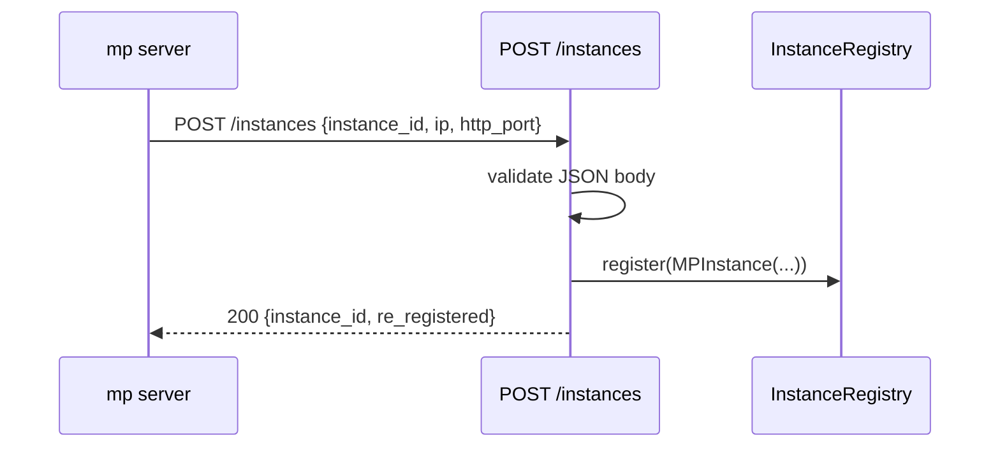
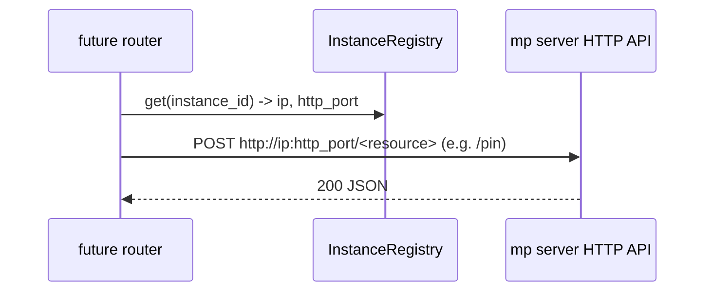

# MP Coordinator

The mp coordinator is a standalone **FastAPI / REST** process that coordinates
LMCache multi-process (mp) cache servers running across nodes as a fleet. This
document describes the backbone: the REST API, the instance registry, and the
health-check loop. Domain capabilities (quota reconcile, blend-lookup routing,
KV-op fan-out) are not implemented yet; they are added as new REST routers.

Code: `lmcache/v1/mp_coordinator/`.

## Why

mp servers are independent today: quota is per-instance and in-memory, there is
no cross-node token-match routing for model replicas, and KV operations are
local. The coordinator is the fleet-level component those features will hang
off. This PR ships the framework plus membership so future work plugs in
without re-architecting.

## Transport

The coordinator is a FastAPI app served by uvicorn. mp servers register /
heartbeat / deregister over REST.

| Method & path | Direction | Purpose |
| --- | --- | --- |
| `POST /instances` | mp → coordinator | register (or re-register) |
| `PUT /instances/{id}/heartbeat` | mp → coordinator | heartbeat (404 ⇒ re-register) |
| `DELETE /instances/{id}` | mp → coordinator | deregister (idempotent, 204) |
| `GET /instances` | operator/tools | list the fleet |
| `GET /healthz` | k8s probe | liveness |

For server-initiated work (future quota reconcile, KV-op fan-out) a coordinator
router resolves an instance's address from the registry (`ip` + `http_port`) and
POSTs to that mp server's **specific** existing endpoint (e.g. `/pin`,
`/quota`). There is no generic command channel and no per-instance connection
state — just an HTTP call to the relevant resource.

## Layout

```
lmcache/v1/mp_coordinator/
  app.py            # create_app + lifespan + router discovery + health eviction
  __main__.py       # uvicorn entrypoint
  config.py         # MPCoordinatorConfig (LMCACHE_MP_COORDINATOR_*)
  registry.py       # InstanceRegistry + MPInstance (pure membership)
  schemas.py        # Pydantic request/response models (shared wire contract)
  registrar.py      # mp-server-side register/heartbeat/deregister helpers
  http_apis/
    instances_api.py  # the /instances REST resource
    health_api.py     # /healthz
```

## Request flow

Registration, end to end:



Heartbeat is `PUT /instances/{id}/heartbeat` → `registry.update_heartbeat`; a
404 tells the client to re-register. The health loop (in `app.py`, started by
the lifespan) evicts instances whose heartbeat lapsed. Future server push
resolves the address (`ip` + `http_port`) from the registry and calls the mp
server's specific endpoint directly:



## Extension seam (adding a capability)

`app.state` carries the **shared collaborators** every capability composes from:
`config` and `registry`. Endpoints use them directly — membership is thin enough
to have no service layer (the `/instances` router calls the registry straight,
matching the mp server's own `http_apis` convention).

To add a capability (e.g. quota):

1. `http_apis/quota_api.py` — a module-level `router` (FastAPI `APIRouter`).
   `create_app` auto-discovers it (via `lmcache/v1/utils/router_discovery.py`,
   the same convention as the mp server's HTTP API). No edits elsewhere for the
   route to appear; the router reads `app.state.registry`, and to push it
   resolves an instance's `ip`/`http_port` and POSTs to that mp server's
   endpoint.
2. Only if the domain has real logic/state of its own (e.g. quota: persistence,
   broadcast-on-join) add a `quota_service.py` over the shared collaborators and
   stash it on `app.state` in `create_app`. Thin domains skip this.

A capability that must react to instance join/leave can hook into the
registration endpoint (a small observer can be reintroduced then — it was
dropped from the backbone as it had no consumer yet).

> **Notice — keep request handlers non-blocking.** Endpoints run on the event
> loop. Heavy work (pushing to mp servers, store reads) must be `await`ed on
> async clients or scheduled as a task (`asyncio.create_task`), and CPU-bound
> work sent to a thread (`run_in_executor`), so request latency and the health
> loop are not blocked.

## Registry (`registry.py`)

`InstanceRegistry` maps `instance_id` → `MPInstance` (ip, http_port,
heartbeat timestamps, metadata). Membership is pure — no sockets, no model or
parallel-config info — so a server hosting several models is represented
correctly; model-aware indexing belongs to a future routing router. Thread-safe
(`threading.Lock`); `stale()` uses a monotonic clock so an NTP step cannot skew
liveness.

## Concurrency & lifecycle

- Everything runs on the uvicorn event loop; the registry lock guards the one
  piece of shared state.
- The health-check loop is an asyncio task started in the app lifespan; it
  evicts instances whose heartbeat lapsed (`instance_timeout`) and is cancelled
  on shutdown. `health_check_interval = 0` disables it.
- Registration is idempotent: re-registering replaces the entry. The registry
  is ephemeral — rebuilt from heartbeats after a coordinator restart; durable
  state (quota) belongs in an external store (Redis), not here.

## Running

```
lmcache coordinator [--host HOST] [--port PORT] \
    [--instance-timeout SECS] [--health-check-interval SECS]
```

(or, equivalently, `python -m lmcache.v1.mp_coordinator`).

Configured via `LMCACHE_MP_COORDINATOR_*` environment variables — see
`MPCoordinatorConfig` in `config.py` (`HOST`, `PORT`, `INSTANCE_TIMEOUT`,
`HEALTH_CHECK_INTERVAL`). The `lmcache coordinator` CLI flags override the
matching env-derived field; unset flags fall back to the env vars and then the
config defaults.

An mp server joins via the `registrar.py` helpers — no dedicated client object,
mirroring how the coordinator just calls mp endpoints. The mp server's FastAPI
lifespan creates a generic `httpx.AsyncClient` and launches `keep_registered()`
as a task: it `POST`s `/instances`, `PUT`s `/instances/{id}/heartbeat` on a
timer, and `DELETE`s on cancellation — on the mp server's own event loop, using
the shared `schemas` models. It is wired into
`lmcache/v1/multiprocess/http_server.py`'s lifespan and configured by a
`CoordinatorConfig` (`lmcache/v1/multiprocess/config.py`), built from
`--coordinator-*` flags that fall back to `LMCACHE_COORDINATOR_*` env vars. It is
**opt-in**: with no coordinator URL, the mp server is unaffected. It is
best-effort — failures are logged and retried (a down coordinator never blocks
the server), while a malformed config is rejected at startup. The server
advertises its own HTTP address (`ip` + `http_port`, e.g. the pod IP via the k8s
downward API) so the coordinator can reach it.
