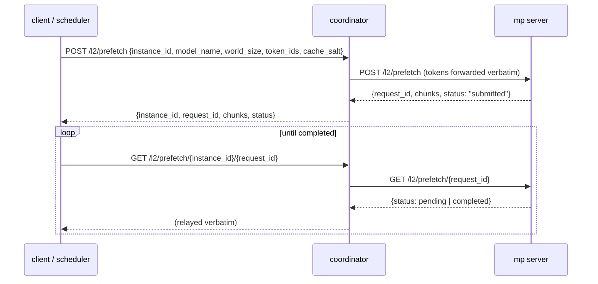

# Coordinator-Controlled L2→L1 Prefetch

## Why

An operator or scheduler that knows a node will soon serve a particular prompt
(a traffic shift, a known-hot shared prefix) needs a way to **pre-warm** that
node's L1 from L2 before the requests land. The coordinator already pushes L2
*evict* and *resync* to nodes; this adds the symmetric *prefetch* control.

## Flow

A client names **one** registered MP server and a **token sequence** (plus the
model/world_size and tenant salt). The coordinator resolves the target's
address from the registry, `POST`s to its `/l2/prefetch`, and relays the
server's `request_id` back. The client then polls
`GET /l2/prefetch/{instance_id}/{request_id}` on the coordinator, which proxies
the server's status. The warm holds **no read-lock** — completion is reported
reactively and releases nothing; see `docs/design/v1/multiprocess/l2_apis.md`
for the warm-prefetch lifecycle (retain-permanent, no-lock load). There is no
background polling on either side: the submit and status calls are quick and
the client drives completion on demand.

## Components

- **`schemas.py`** — `PrefetchRequest {instance_id, model_name, world_size,
  token_ids, cache_salt}` and `PrefetchResponse {instance_id, request_id,
  chunks, status}`.
- **`l2/prefetch_manager.py`** — `L2PrefetchManager`. `submit_prefetch` awaits
  the target's `POST /l2/prefetch` and returns its reply; `get_status` proxies
  `GET /l2/prefetch/{request_id}` and relays `(status_code, body)`. No
  fire-and-forget tasks — both calls are quick.
- **`http_apis/l2_api.py`** — `POST /l2/prefetch` and
  `GET /l2/prefetch/{instance_id}/{request_id}`. Each resolves the target via
  `registry.get(instance_id)` (**404** if unknown) and uses the shared outbound
  `httpx.AsyncClient` on `app.state.outbound_client`; a transport error to the
  target surfaces as **502**.

## Wiring (`app.py`)

`create_app` instantiates `L2PrefetchManager` and puts it on
`app.state.prefetch_manager`. The lifespan stashes the outbound client on
`app.state.outbound_client` (it previously reached only the background loops)
so request handlers can issue outbound calls.

## Failure modes

- **Unknown `instance_id`** → 404 (synchronous, before any outbound call).
- **Target unreachable / non-2xx submit** → 502 from the coordinator (the
  caller learns the submit failed, unlike a fire-and-forget dispatch).
- **Target has no layout for `(model_name, world_size)`** → the server returns
  409, surfaced to the caller via the 502/proxy path.
- **Client abandons polling** → the server's job lingers as a small handle
  entry (no lock held, no L1 pinned) until polled or swept — see the no-lock
  lifecycle in `l2_apis.md`.

## Scope

The coordinator only routes submit + status; it does not track which keys a
node already holds or retry. Completion is observed via the status endpoint
(the warm acquires no read-lock, so it emits no `SM_READ_PREFETCHED_FINISHED`;
the load itself still surfaces through the controller's
`L2_PREFETCH_LOAD_COMPLETED` event).

### Single-node vs. multi-node

One `instance_id` is **one node's** MP server, and its L1 is shared with that
node's workers via intra-node CUDA IPC — so it holds only the KV shards for the
`global_rank`s served on that node. Concretely:

- **Single-node deployment** (all `world_size` workers on one box, e.g. TP=8 on
  one node): one instance holds every shard. A single `POST /l2/prefetch`
  warms the whole model's KV for the prompt. **This is the supported case.**
- **Multi-node deployment** (TP/PP spanning nodes): each node holds only its
  slice. A single dispatch warms one node; the caller must warm *each* node's
  `instance_id` to cover the full model. The MP server's all-rank fan-out also
  loads foreign-rank keys that no local worker reads — harmless (best-effort:
  they occupy L1 as unread, retained-but-unlocked entries that eviction
  reclaims under pressure), but not optimal.

**Coordinating multi-node fan-out — choosing the right set of `instance_id`s
and restricting each to its local ranks — is deferred to the KV cache
directory** (separate PR). The directory is the component that knows which node
holds which shard; this endpoint is the per-node primitive it will drive.
Restricting the fan-out to local ranks is intentionally *not* done here because
the MP server does not yet track which `global_rank`s it serves — that per-node
rank topology is directory-owned infrastructure.
