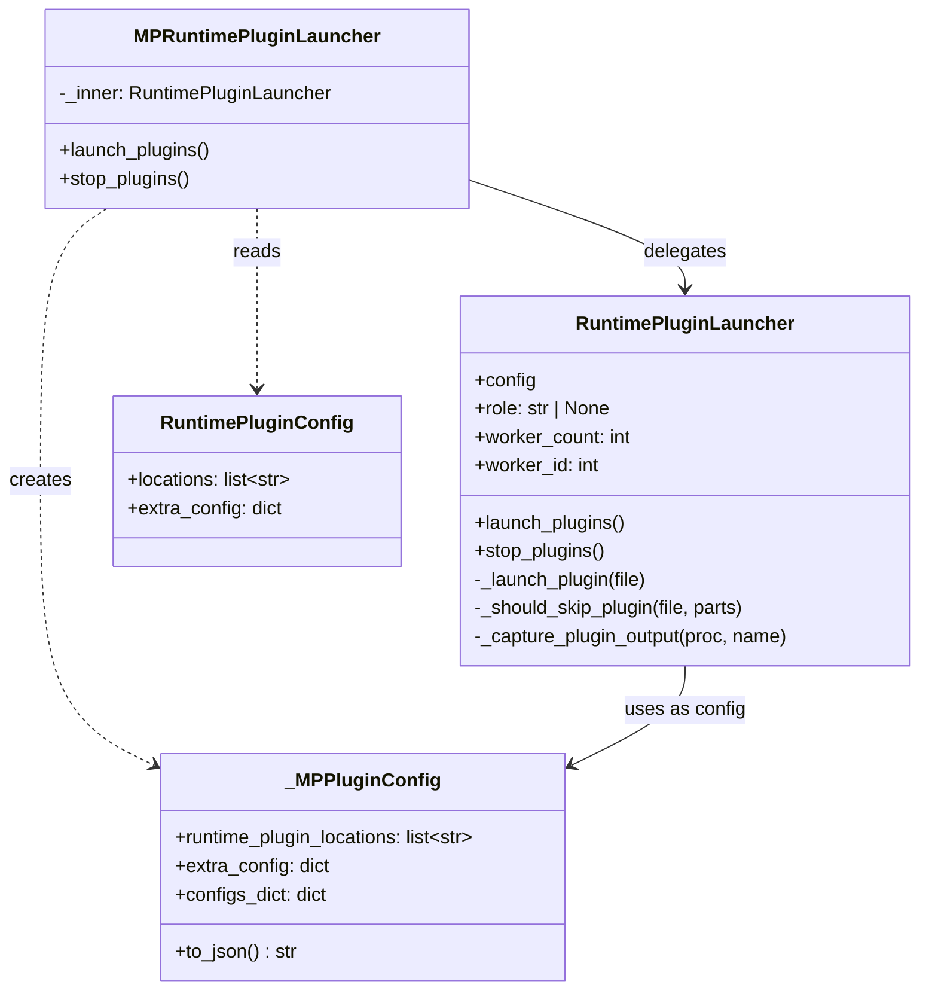
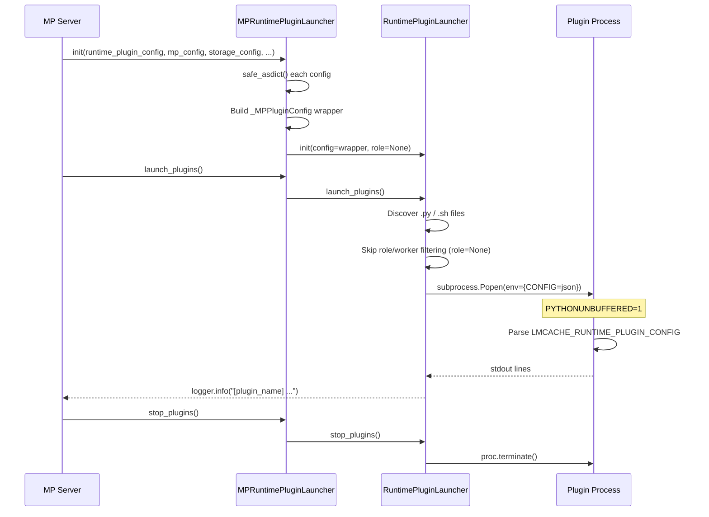
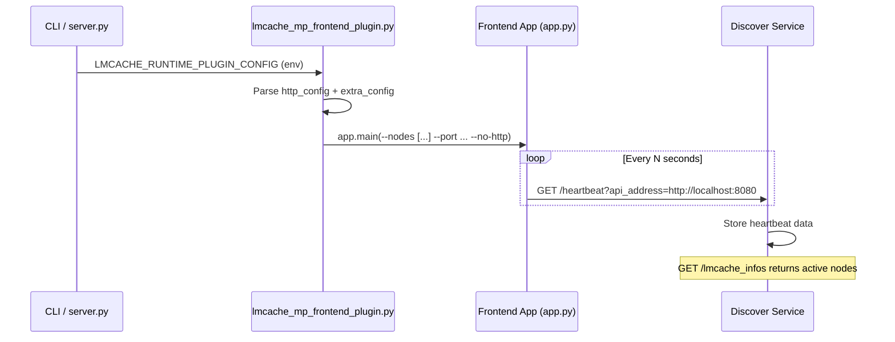

# MP Runtime Plugin Design

## Overview

The **MP Runtime Plugin** framework allows users to run custom
scripts (Python or Bash) alongside the LMCache multiprocess (MP /
ZMQ) server. Plugins receive the full server configuration via an
environment variable and run as child processes whose stdout is
captured into the LMCache logger.

Unlike the non-MP (vLLM integration) mode where plugins receive a
single `LMCacheEngineConfig`, the MP mode has multiple independent
config dataclasses (`MPServerConfig`, `StorageManagerConfig`,
`ObservabilityConfig`, etc.). The `MPRuntimePluginLauncher`
aggregates them all into a single JSON blob before delegating to
the base `RuntimePluginLauncher`.

---

## Key Components

### `MPRuntimePluginLauncher`

The MP-specific entry point. Accepts arbitrary dataclass configs
via `**kwargs`, serializes them into a single JSON dict, and
delegates all process management to `RuntimePluginLauncher`.

| Method | Description |
|---|---|
| `__init__(runtime_plugin_config, **configs)` | Aggregate configs → JSON, create inner launcher |
| `launch_plugins()` | Delegate to `RuntimePluginLauncher.launch_plugins()` |
| `stop_plugins()` | Delegate to `RuntimePluginLauncher.stop_plugins()` |

Key design decisions:

- **`role=None`**: MP mode has no role concept (no SCHEDULER /
  WORKER split). Passing `None` disables the filename prefix-based
  role filtering in the base launcher.
- **`worker_count=1, worker_id=0`**: The MP server runs a single
  process instance; there is no TP-style worker sharding.

### `RuntimePluginConfig`

A dataclass that holds plugin configuration:

| Field | Type | Description |
|---|---|---|
| `locations` | `list[str]` | Plugin file / directory paths |
| `extra_config` | `dict` | Extra key-value config forwarded to plugins via JSON blob |

Accepted via `--runtime-plugin-config` CLI argument as a JSON string.

### `_MPPluginConfig`

A thin `@dataclass` wrapper that satisfies the duck-type contract
expected by `RuntimePluginLauncher`:

| Field / Method | Type | Description |
|---|---|---|
| `runtime_plugin_locations` | `list[str]` | Plugin file / directory paths |
| `extra_config` | `dict` | Extra config from `RuntimePluginConfig.extra_config` |
| `configs_dict` | `dict` | Aggregated config sections |
| `to_json()` | `str` | Serialize `configs_dict` + `extra_config` to JSON string |

### `safe_asdict` / `make_json_safe`

Public helpers in `lmcache.v1.utils.json_utils` that convert
dataclass instances to dicts while handling non-serializable
fields (e.g. `pathlib.Path`) by falling back to `str()`.
`safe_asdict` operates on dataclass instances; `make_json_safe`
recursively sanitizes arbitrary values (dicts, lists, tuples,
primitives) and is also reused by the `/config` HTTP endpoint.

### `RuntimePluginLauncher` (base)

The base launcher (in `lmcache.v1.plugin`) handles:

- Discovering plugin files (`.py` / `.sh`) in configured locations
- Role-based filtering (skipped when `role=None`)
- Worker-ID-based filtering
- Interpreter detection (shebang → fallback)
- Subprocess management (`Popen` with piped stdout)
- Real-time log capture via background threads
- Graceful shutdown via `atexit`

---

## Architecture



---

## Data Flow



---

## Environment Variables

The base launcher sets the following environment variables for
each plugin subprocess:

| Variable | Value in MP mode | Description |
|---|---|---|
| `LMCACHE_RUNTIME_PLUGIN_CONFIG` | Aggregated JSON | Full server config |
| `LMCACHE_RUNTIME_PLUGIN_ROLE` | `""` (empty) | No role in MP mode |
| `LMCACHE_RUNTIME_PLUGIN_WORKER_COUNT` | `"1"` | Single server process |
| `LMCACHE_RUNTIME_PLUGIN_WORKER_ID` | `"0"` | Always worker 0 |
| `PYTHONUNBUFFERED` | `"1"` | Force real-time stdout |

Legacy aliases (`LMCACHE_PLUGIN_*`) are also set for backwards
compatibility.

---

## Input from LMCache to Plugin

LMCache passes configuration to plugins via **environment
variables**. The core variable is `LMCACHE_RUNTIME_PLUGIN_CONFIG`,
whose value is a JSON string containing the full LMCache server
configuration.

### Input Sources

```
CLI arguments
  --runtime-plugin-locations  ->  RuntimePluginConfig.locations
  --runtime-plugin-config     ->  RuntimePluginConfig.extra_config (JSON)
  --http-host / --http-port   ->  HTTPFrontendConfig
                                  (optional, forwarded by http_server.py)

MPRuntimePluginLauncher.__init__(
    runtime_plugin_config,   # locations + extra_config
    mp_config,               # ZMQ server config
    storage_manager_config,  # storage config
    obs_config,              # observability config
    http_config,             # HTTP config (optional)
)
```

### Config JSON Structure

```json
{
  "mp_config": {
    "host": "localhost",
    "port": 5555,
    "chunk_size": 256,
    "max_workers": 1,
    "hash_algorithm": "blake3",
    "engine_type": "default",
    "runtime_plugin_config": {
      "locations": ["examples/mp_runtime_plugins/"],
      "extra_config": {}
    }
  },
  "storage_manager_config": {
    "l1_manager_config": {
      "memory_config": {
        "size_in_bytes": 10737418240,
        "use_lazy": true
      }
    },
    "eviction_config": {
      "eviction_policy": "LRU",
      "trigger_watermark": 0.8,
      "eviction_ratio": 0.2
    }
  },
  "obs_config": {
    "enabled": true,
    "metrics_enabled": true,
    "logging_enabled": true,
    "tracing_enabled": false
  },
  "http_config": {
    "http_host": "0.0.0.0",
    "http_port": 8080
  },
  "runtime_plugin_extra_config": {
    "plugin.frontend.heartbeat_url": "http://discover-service:5000/heartbeat"
  }
}
```

`runtime_plugin_extra_config` is only present when
`RuntimePluginConfig.extra_config` is non-empty; it is merged in by
`_MPPluginConfig.to_json()`.

### How Plugins Read the Config

```python
import json
import os

raw = os.getenv("LMCACHE_RUNTIME_PLUGIN_CONFIG", "{}")
config = json.loads(raw)

mp_cfg = config.get("mp_config", {})
http_cfg = config.get("http_config", {})
extra = config.get("runtime_plugin_extra_config", {})
```

---

## Use Cases

### Use Case 1: Frontend Plugin (Service Discovery Heartbeat)

**Scenario**: Run an HTTP frontend process alongside the LMCache MP
server; the process periodically sends heartbeats to a discovery
service so that a centralized frontend can track live LMCache nodes.

**Components**:

| Component | Path | Description |
|---|---|---|
| `lmcache_mp_frontend_plugin.py` | `lmcache/lmcache_frontend/lmcache_mp_plugin/lmcache_mp_frontend_plugin.py` | Plugin script; reads config and launches the frontend app |
| `simple_discover_service.py` | `lmcache/tools/simple_discover_service.py` | Simple discovery service that receives heartbeats |
| `app.py` | `lmcache/lmcache_frontend/app.py` | Centralized LMCache frontend; proxies requests to backend nodes |

**Data Flow**:



**Startup Commands**:

```bash
# 1. Start discover service
python -m lmcache.tools.simple_discover_service

# 2. Start LMCache MP server with frontend plugin
python -m lmcache.v1.multiprocess.http_server \
    --host localhost --port 5555 \
    --l1-size-gb 10 \
    --http-host 0.0.0.0 --http-port 8080 \
    --runtime-plugin-locations lmcache/lmcache_frontend/lmcache_mp_plugin/lmcache_mp_frontend_plugin.py \
    --runtime-plugin-config '{"plugin.frontend.heartbeat_url": "http://localhost:5000/heartbeat"}'
```

**How the Plugin Uses the Config**:

1. Reads `http_host` / `http_port` from `http_config` to
   auto-build the `--nodes` argument, avoiding duplicate CLI flags.
2. Reads `plugin.frontend.*` keys from `runtime_plugin_extra_config`
   and converts them into `app.main()` CLI arguments (e.g.
   `--heartbeat-url`).

---

### Use Case 2: Chunk Hash File Upload Agent

**Scenario**: LMCache produces JSONL-format chunk hash files during
operation (see [PR #2928](https://github.com/LMCache/LMCache/pull/2928)).
A plugin acts as an agent that periodically scans and uploads those
files to a remote storage service (S3, HDFS, OSS, etc.).

**Plugin Responsibilities**:

1. Read `storage_manager_config` from
   `LMCACHE_RUNTIME_PLUGIN_CONFIG` to determine the chunk hash file
   output directory.
2. Read upload target settings from `runtime_plugin_extra_config`
   (e.g. `plugin.uploader.s3_bucket`, `plugin.uploader.prefix`).
3. Periodically scan the output directory and upload newly
   produced `.jsonl` files to remote storage.
4. Optionally archive or delete local files after successful
   upload.

---

## Plugin Contract

A runtime plugin **must**:

1. Be a `.py` or `.sh` file in one of the configured
   `runtime_plugin_locations`.
2. Be executable by the detected interpreter (Python or Bash).
3. Read configuration from the `LMCACHE_RUNTIME_PLUGIN_CONFIG`
   environment variable if needed.

A runtime plugin **should**:

1. Print status / heartbeat messages to stdout (they will be
   captured by the launcher and logged via `logger.info`).
2. Handle `SIGTERM` gracefully for clean shutdown.
3. Output single-line messages (each stdout line becomes a
   separate log entry).

---

## Plugin Discovery & Filtering

```
runtime_plugin_locations: ["examples/mp_runtime_plugins/"]
         │
         ▼
    Path.rglob("*.py") + Path.rglob("*.sh")
         │
         ▼
    _should_skip_plugin(file, parts)
         │
         ├─ role is None? → skip role check (MP mode)
         │
         ├─ role is set? → parts[0].upper() must match
         │                  role or be "ALL"
         │
         └─ worker_id check → parts[1] if numeric
         │
         ▼
    _launch_plugin(file)
         │
         ├─ Detect interpreter (shebang → fallback)
         ├─ Set environment variables
         ├─ subprocess.Popen(...)
         └─ Start capture thread
```

---

## Example Plugins

See `examples/mp_runtime_plugins/` for reference implementations:

| File | Language | Description |
|---|---|---|
| `mp_plugin.py` | Python | Parses config, prints summary, runs periodic heartbeat |
| `mp_heartbeat.sh` | Bash | Extracts config via `jq`, runs heartbeat loop |

### Quick Start

```bash
python -m lmcache.v1.multiprocess.http_server \
    --host localhost --port 5555 \
    --l1-size-gb 10 \
    --eviction-policy LRU \
    --runtime-plugin-locations examples/mp_runtime_plugins/
```

Expected log output:

```
[mp_plugin.py] Started
[mp_plugin.py] Config: {"mp_config": {...}, ...}
[mp_heartbeat.sh] Config: {"mp_config": {...}, ...}
```

---
