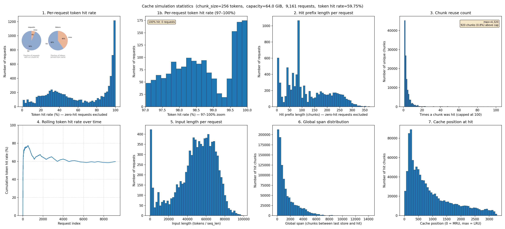
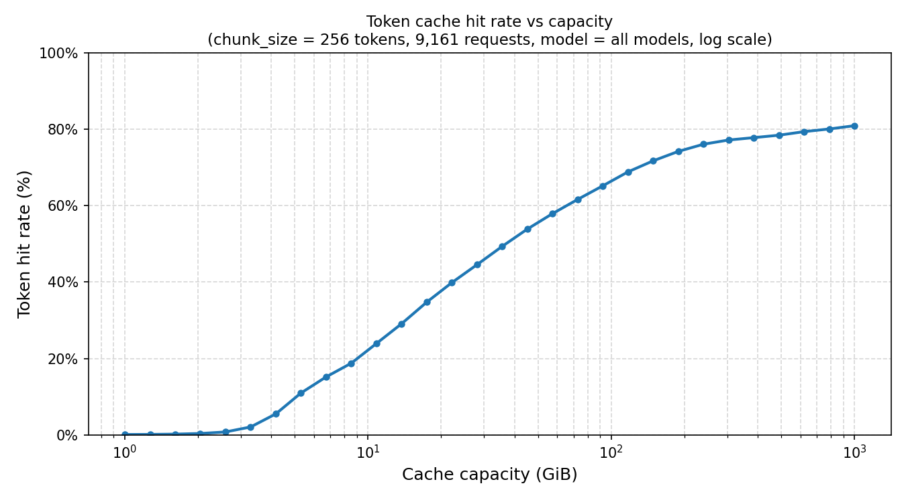

# Cache Simulator

The cache simulator replays recorded LMCache lookup events to measure **token cache hit rate** — the fraction of input tokens served from the KV cache rather than recomputed. It answers questions like:

- What hit rate can I expect for my workload at a given cache size?
- How much cache memory do I need to reach 80% / 90% hit rate?
- Which requests benefit most from caching?

## Table of Contents

- [How it Works](#how-it-works)
- [Quick Start](#quick-start)
- [Step 1: Enable Lookup Hash Logging](#step-1-enable-lookup-hash-logging)
- [Step 2: Run the Simulator](#step-2-run-the-simulator)
- [Step 3: Plot Hit Rate vs Capacity](#step-3-plot-hit-rate-vs-capacity)
- [Understanding the Output](#understanding-the-output)
- [CLI Reference](#cli-reference)
- [For Developers](#for-developers)

---

## How it Works

LMCache splits each request's KV cache into fixed-size **chunks** and identifies them by hash. The simulator replays those hashes through a simulated LRU cache to predict hit rate without running the actual model.

### Token hit rate

The primary metric is **token hit rate**, not chunk hit rate:

```
token_hit_rate = total_hit_tokens / total_tokens
```

Where:

- `total_tokens` is the sum of `seq_len` across all requests — this includes **tail tokens** (the partial chunk at the end of each sequence that does not fill a complete chunk). Tail tokens are always a miss because LMCache only caches complete chunks.
- `total_hit_tokens` is the number of tokens covered by a **continuous hit prefix** at the start of each request: if the first *k* chunks are all cache hits, that contributes `k × chunk_size` hit tokens.

This is the same definition used by the LMCache server itself.

### Prefix caching semantics

The simulator enforces the same prefix rule as LMCache: a chunk is only counted as a hit if it **and every chunk before it** in the request are cached. The first miss breaks the prefix — subsequent chunks are not counted as hits even if they happen to be in cache.

### Cache model

- **Eviction policy:** LRU (Least Recently Used)
- **Cache key:** chunk hash (hex string, opaque)
- **Capacity unit:** bytes of KV cache memory

---

## Quick Start

```bash
# 1. Collect logs from a live server (see Step 1 below)
lmcache server --lookup-hash-log-dir /data/lmcache/lookup_hashes ...

# 2. Simulate at a fixed capacity — prints text report and saves a PNG chart
lmcache tool cache-simulator simulate \
    -i /data/lmcache/lookup_hashes \
    --cache-capacity-gib 64 \
    -o stats.png

# 3. Sweep across capacities to find the right cache size
lmcache tool cache-simulator sweep \
    -i /data/lmcache/lookup_hashes \
    --min-capacity-gib 1 \
    --max-capacity-gib 512 \
    --points 30 \
    -o sweep.png
```

---

## Step 1: Enable Lookup Hash Logging

Start the LMCache server with `--lookup-hash-log-dir` pointing to a writable directory:

```bash
lmcache server \
    --host 0.0.0.0 \
    --port 8080 \
    --chunk-size 256 \
    --lookup-hash-log-dir /data/lmcache/lookup_hashes \
    --lookup-hash-log-rotation-interval 21600 \
    --lookup-hash-log-rotation-max-size 104857600 \
    --lookup-hash-log-max-files 100
```

The server will write rotating JSONL files to that directory. Each line is one request:

```json
{
  "timestamp": 1711929600.123,
  "request_id": "req-001",
  "model_name": "DeepSeek-V3",
  "chunk_size": 256,
  "seq_len": 8192,
  "dtypes": ["float8_e4m3fn"],
  "shapes": [[32, 256, 128]],
  "chunk_hashes": ["0xabcd1234...", "0xef567890...", ...]
}
```

| Field | Description |
|---|---|
| `timestamp` | Unix timestamp of the lookup |
| `request_id` | Unique request identifier |
| `model_name` | Model being served |
| `chunk_size` | Tokens per chunk |
| `seq_len` | Total input tokens (including tail) |
| `dtypes` | KV tensor data types |
| `shapes` | KV tensor shapes (used to compute bytes/chunk) |
| `chunk_hashes` | Ordered list of full-chunk hashes (hex strings) |

Note: `chunk_hashes` only covers **complete** chunks. The tail tokens (`seq_len mod chunk_size`) are not represented — they are implicitly always a miss.

---

## Step 2: Run the Simulator

```bash
lmcache tool cache-simulator simulate \
    -i /data/lmcache/lookup_hashes \
    --cache-capacity-gib 64 \
    -o stats.png
```

This prints a full text report to the terminal **and** saves a 7-panel statistics chart to `stats.png`. The `kv_bytes_per_chunk` value is auto-detected from the `shapes` and `dtypes` fields of the first event. You can override it:

```bash
lmcache tool cache-simulator simulate \
    -i /data/lmcache/lookup_hashes \
    --cache-capacity-gib 64 \
    --kv-bytes-per-chunk 20971520 \
    -o stats.png
```

To analyse only one model when the logs contain multiple:

```bash
lmcache tool cache-simulator simulate \
    -i /data/lmcache/lookup_hashes \
    --cache-capacity-gib 64 \
    --model DeepSeek-V3 \
    -o stats.png
```

### Example text output

```
============================================================
Aggregate
============================================================
  Requests processed  : 9,161
  Total tokens        : 449,114,449
  Hit tokens          : 268,330,752
  Miss tokens         : 180,783,697
  Token hit rate      : 59.75%
  Cache capacity      : 64.00 GiB  (3,276 chunks × 20,971,520 bytes/chunk)
  Cache occupancy     : 3,276 / 3,276 chunks

============================================================
Stat 1 — Per-request token hit rate distribution
============================================================
  Requests with 0% hit rate   : 38 (0.4%)
  Requests with 100% hit rate : 3 (0.0%)
  Mean                        : 80.82%
  p50                         : 90.59%
  p90                         : 98.85%
  p99                         : 99.93%
...
```

### Example statistics chart



---

## Step 3: Plot Hit Rate vs Capacity

The plot tool sweeps across a log-spaced range of cache sizes and shows how hit rate changes with capacity — the key curve for capacity planning.

```bash
lmcache tool cache-simulator sweep \
    -i /data/lmcache/lookup_hashes \
    --min-capacity-gib 1 \
    --max-capacity-gib 512 \
    --points 30 \
    -o sweep.png
```

This prints a table and saves a PNG:

```
    Capacity (GiB)    Hit rate
--------------------------------
             1.000     29.18%
             2.151     36.93%
             9.257     51.44%
            39.830     63.51%
           118.993     68.96%
           512.000     78.58%
```

The x-axis is in GiB (log scale by default). Use `--linear` for a linear scale.

### Example capacity sweep chart



---

## Understanding the Output

### Text report statistics

| Stat | What it measures |
|---|---|
| **Aggregate** | Overall token hit rate, capacity utilisation, eviction count |
| **Stat 1** | Per-request hit rate distribution (mean, percentiles, 0%/100% counts) |
| **Stat 2** | Hit prefix length per request in chunks (how far the prefix match extends) |
| **Stat 3** | Chunk reuse count distribution (how many times each unique chunk was hit) |
| **Stat 4** | Rolling cumulative hit rate over time (does the cache warm up quickly?) |
| **Stat 5** | Total evictions (non-zero means the cache was full and chunks were displaced) |
| **Stat 6** | Global span distribution — chunks processed between when a chunk was last stored and when it was hit again (measures temporal locality) |
| **Stat 7** | Cache position at hit time (0 = MRU, max = LRU; low values mean recently-used chunks are being hit, high values indicate stale hits that nearly got evicted) |

### Chart panels (stats.png)

The saved PNG contains the same seven statistics as visual histograms:

| Panel | Chart |
|---|---|
| **1** | Per-request token hit rate histogram + hit/miss request pie inset |
| **1b** | Same zoomed into the 97–100% range |
| **2** | Hit prefix length per request + hit/miss token pie inset |
| **3** | Chunk reuse count histogram (x-axis capped at 100) |
| **4** | Rolling cumulative token hit rate over time |
| **5** | Input length per request (tokens) |
| **6** | Global span distribution |
| **7** | Cache position at hit time |

---

## CLI Reference

### `simulate` — single-run report and chart

```
lmcache tool cache-simulator simulate [OPTIONS]
```

| Option | Default | Description |
|---|---|---|
| `-i / --input PATH [PATH ...]` | required | JSONL files or directories (directories are globbed for `lookup_hashes_*.jsonl`) |
| `--cache-capacity-gib GiB` | required | Cache size in gibibytes |
| `-o / --output FILE` | `cache_stats.png` | Output image path |
| `-n / --max-samples N` | all | Truncate to N events after sorting by timestamp |
| `--model NAME` | all | Filter by `model_name` (exact match) |
| `--kv-bytes-per-chunk BYTES` | auto | KV bytes per chunk; auto-computed from first event if omitted |

### `sweep` — capacity sweep and plot

```
lmcache tool cache-simulator sweep [OPTIONS]
```

| Option | Default | Description |
|---|---|---|
| `-i / --input PATH [PATH ...]` | required | JSONL files or directories |
| `--min-capacity-gib GiB` | `0.5` | Lower bound of capacity sweep |
| `--max-capacity-gib GiB` | `500` | Upper bound of capacity sweep |
| `--points N` | `30` | Number of log-spaced capacity samples |
| `--linear` | off | Use linear x-axis instead of log scale |
| `-o / --output FILE` | `hit_rate_vs_capacity.png` | Output image path |
| `-n / --max-samples N` | all | Truncate events |
| `--model NAME` | all | Filter by model name |
| `--kv-bytes-per-chunk BYTES` | auto | KV bytes per chunk |

### `gen-dataset` — generate vllm bench serve dataset

```
lmcache tool cache-simulator gen-dataset [OPTIONS]
```

| Option | Default | Description |
|---|---|---|
| `-i / --input PATH [PATH ...]` | required | JSONL files or directories |
| `--tokenizer PATH` | required | HuggingFace tokenizer path or name |
| `--output-len N` | `128` | `output_tokens` per request |
| `-o / --output FILE` | `bench_dataset.jsonl` | Output JSONL path |
| `-n / --max-samples N` | all | Truncate events |
| `--model NAME` | all | Filter by model name |

### How token generation works

1. A *safe vocabulary* is built from the tokenizer: token IDs that decode to printable text and round-trip stably through `encode(decode([id])) == [id]`. Tokens with a leading space are preferred to prevent BPE merges at chunk boundaries.
2. Each unique chunk hash is mapped deterministically to `chunk_size` token IDs by seeding a PRNG with `SHA-256(hash)`. The same hash always produces the same tokens.
3. Tail tokens (`seq_len mod chunk_size`) use a per-request seed so they are never accidentally shared across requests (matching LMCache's behaviour of never caching partial chunks).
4. The full token list is decoded to text and written as the `"prompt"` field. `"output_tokens"` is set to `--output-len`.

---

## For Developers

### Package layout

```
lmcache/tools/cache_simulator/
    __init__.py             — package marker
    lru_cache.py            — LRUCache and LRUCacheFast implementations
    simulator.py            — event loading, simulation engine, text report, chart, CLI
    plot_hit_rate.py        — capacity sweep and matplotlib plot
    gen_bench_dataset.py    — lookup-hash → vllm bench serve dataset converter

lmcache/cli/commands/tool/
    __init__.py             — ToolCommand dispatcher (lmcache tool ...)
    cache_simulator.py      — wires cache-simulator into the lmcache CLI
```

### CLI integration

The same functionality is also accessible via the `lmcache` CLI (see
[Quick Start](#quick-start)).  The CLI entry point lives in
`lmcache/cli/commands/tool/cache_simulator.py`, which calls
`add_simulate_arguments` / `run_simulate` from `simulator.py` and
`add_sweep_arguments` / `run_sweep` from `plot_hit_rate.py`.

**When adding or removing a CLI flag**, update only the relevant
`add_*_arguments` function in `simulator.py` or `plot_hit_rate.py` — the
`lmcache tool` command picks up the change automatically.

**When adding a new action** (e.g. `lmcache tool cache-simulator compare`),
register it in `lmcache/cli/commands/tool/cache_simulator.py` alongside the
existing `simulate` and `sweep` actions.

### `lru_cache.py`

Two implementations are provided to trade off speed against feature richness:

**`LRUCacheFast`** — O(1) all operations, backed by a single `OrderedDict`. Supports `contains`, `access`, `insert`, and `eviction_count`. Used during capacity sweeps where only hit/miss counts are needed.

**`LRUCache`** — O(log n) operations, backed by a `dict` (for O(1) lookup) plus a `SortedList` (for O(log n) rank queries). Adds `position(key)` which returns the LRU rank of a key (0 = MRU, len−1 = LRU). Used in the single-run report for Stat 7.

Both take `capacity` in **number of chunks**. The byte-to-chunk conversion is done by the caller in `simulator.py`.

### `simulator.py`

Key public functions:

**`compute_kv_bytes_per_chunk(event)`** — derives the byte footprint of one cached chunk from a record's `shapes` and `dtypes` fields. Uses a hard-coded `dtype → bytes` table; unknown dtypes warn and contribute 0 bytes.

**`load_lookup_events(paths, model, max_samples)`** — loads and merges events from one or more JSONL files or directories, sorts by `timestamp` ascending, applies optional model filter and sample cap.

**`simulate(events, cache_capacity_bytes, kv_bytes_per_chunk, fast)`** — the core replay loop. Converts byte capacity to chunk count (`capacity_bytes // kv_bytes_per_chunk`), then walks events in order. For each event:

1. Walk `chunk_hashes` from the front; count consecutive hits as `hit_prefix`.
2. Accumulate `hit_prefix × chunk_size` hit tokens and `seq_len` total tokens.
3. Update the cache: `access` for hit chunks, `insert` for miss chunks.
4. In `fast=False` mode, additionally track per-request rates, reuse counts, span distribution, and cache positions.

Returns a dict with all statistics. In `fast=True` mode the per-request and chunk-level lists are empty, making capacity sweeps significantly faster.

**`print_statistics(results)`** — formats and prints the text report to stdout.

**`plot_statistics(results, events, output)`** — renders the 7-panel chart and saves it to `output`.

### Adding a new statistic

1. Add accumulator variables in `simulate()` before the main loop.
2. Populate them inside the `if not fast:` block.
3. Include them in the returned dict.
4. Add a print block in `print_statistics()`.
5. Add a subplot in `plot_statistics()`.

### Feeding custom data

`simulate()` accepts any list of dicts with the fields `chunk_hashes` (list of strings), `seq_len` (int), and `chunk_size` (int). The other fields (`timestamp`, `model_name`, etc.) are only used by `load_lookup_events`. You can construct events programmatically for unit tests or synthetic benchmarks:

```python
from lmcache.tools.cache_simulator.simulator import simulate

events = [
    {"chunk_hashes": ["0xaa", "0xbb"], "seq_len": 600, "chunk_size": 256},
    {"chunk_hashes": ["0xaa", "0xbb"], "seq_len": 600, "chunk_size": 256},
]
result = simulate(events, cache_capacity_bytes=10 * 1024**3, kv_bytes_per_chunk=20971520)
print(f"Token hit rate: {result['token_hit_rate']:.2%}")
```
